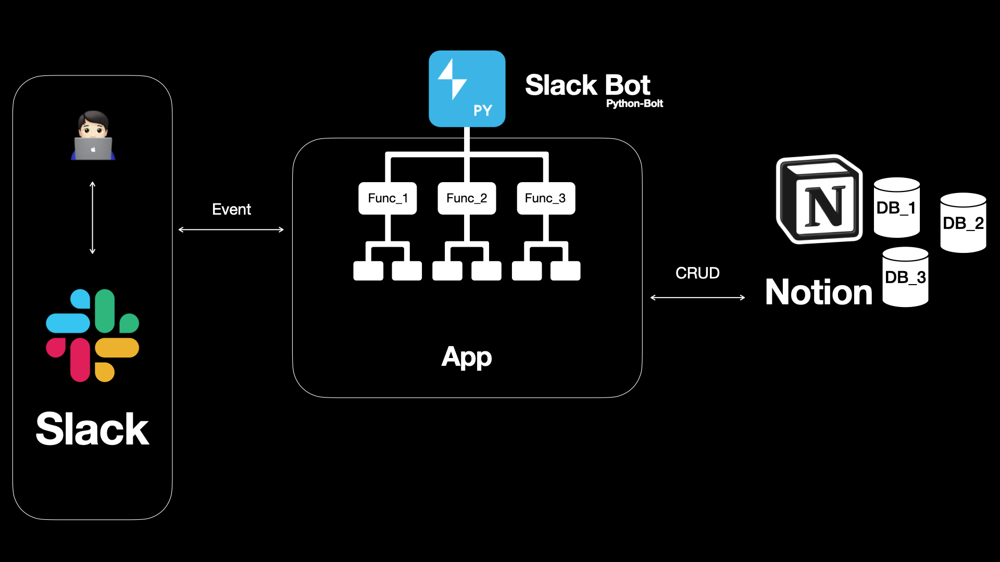

# Slack Bot

* Main Bot and Add Sub functions.

---

## Directory
~~~
└── project_name
    ├── bolt               # bolt(slack) directory
    └── notion             # notion directory
~~~

---

## Environment
~~~
python 3.10 +
~~~

---

## How to start

### 1. Set `.env_temp` => `.env`

[**Required**]
~~~
NOTION = <your-notion-secret-key>
SLACK_APP_TOKEN=xapp-<your-app-level-token>
SLACK_BOT_TOKEN=xoxb-<your-bot-token>
~~~
How to get token of slackapi
  * app_token(xapp)
    >* SlackAPI -> Your-app -> Settings -> Basic Information
  * bot_token(xoxb)
    >* SlackAPI -> Your-app -> Features -> OAuth & Permissions

[**Optional**]
~~~
NOTION_{DB_NAME}=<your-db-id>
~~~

### 2. Run `pip install -r requirements.txt` in terminal.
    
    
### 3. Run `python main.py` in terminal or IDE.

* <main.py>  process is temporary.
    
### 4. Call your bot by texting `bot` in Slack channel
    
* initial name is `bot`# slack-bot
