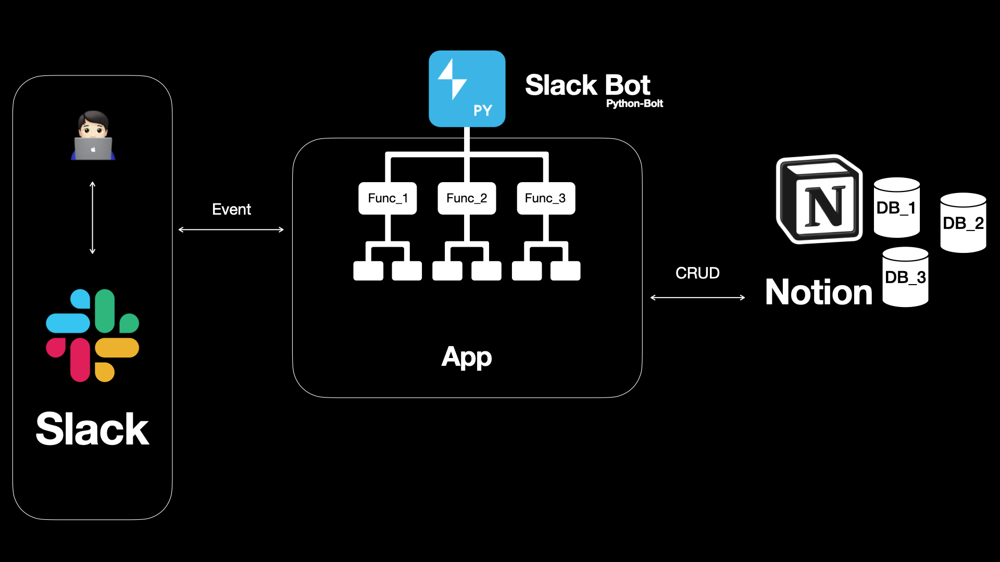
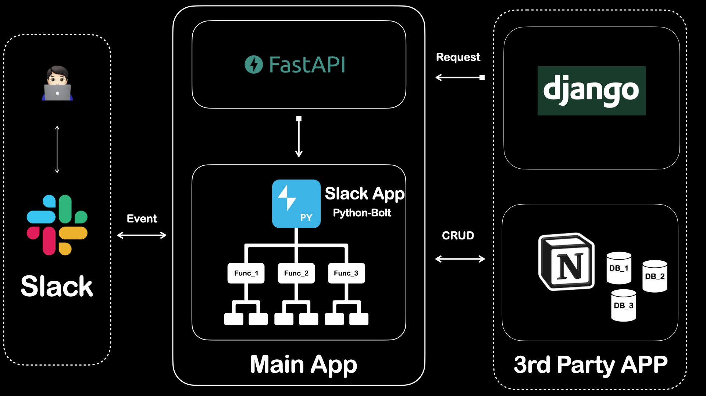

# Slack Bot

* Main Bot and Add Sub functions.(Any SDK or API)

Relationship Diagram v1

  

### Relationship Diagram v2
 

---

## Directory
~~~
└── project_name
    ├── bolt               # bolt(slack) directory
    └── notion             # notion directory
~~~

---

## Environment
~~~
python 3.10
fastapi 0.92.0
~~~

---

## How to start(local)

### 1. Set `.env_temp` => `.env`

[**Required**]
~~~
NOTION = <your-notion-secret-key>
SLACK_APP_TOKEN=xapp-<your-app-level-token>
SLACK_BOT_TOKEN=xoxb-<your-bot-token>
~~~
How to get token of slackapi
  * app_token(xapp)
    >* SlackAPI -> Your-app -> Settings -> Basic Information
  * bot_token(xoxb)
    >* SlackAPI -> Your-app -> Features -> OAuth & Permissions

[**Optional**]

_If you need to connect to Notion Database._
~~~
NOTION_{DB_NAME}=<your-db-id>
~~~

### 2. Run `pip install -r requirements.txt` in terminal.
    
    
### 3. Run `python main.py` in terminal or IDE.

* <main.py>  process is temporary.
    
### 4. How to call your bot
    1. Mention your bot by using @
        - @{bot name}

    2. Use shortcut "/가이드" or "/메인봇"
        - Require to rigster shortcut of slack's app setting

### 5. How to Run FastAPI
~~~
uvicorn app_fastapi:api --reload --host 0.0.0.0 --port 8000 --log-level warning
~~~

---
## Functions

| No  | [Functions Name](https://github.com/IT-HONGREAT/slack_bot/blob/689ee759238e79d0058e82407cad57fdbe8d8264/bolt/actions.py) | FROM -> TO            |
|-----|--------------------------------------------------------------------------------------------------------------------------|-----------------------|
| 1   | [회의실 예약하기](https://github.com/IT-HONGREAT/slack_bot/blob/689ee759238e79d0058e82407cad57fdbe8d8264/bolt/actions.py#L70)   | SLACK -> NOTION       |                            
| 2   | [점심메뉴추천](https://github.com/IT-HONGREAT/slack_bot/blob/689ee759238e79d0058e82407cad57fdbe8d8264/bolt/actions.py#L140)    | NOTION -> SLACK       |
| 3   | [예약 메세지](https://github.com/IT-HONGREAT/slack_bot/blob/dd37adfdb10301ab3b56cd2e77b9d5825eed15ab/bolt/actions.py#L201)    | SLACK(BOT -> USER)    |
| 4   | [똑개 대나무숲](https://github.com/IT-HONGREAT/slack_bot/blob/689ee759238e79d0058e82407cad57fdbe8d8264/bolt/actions.py#L175)   | SLACK(BOT -> CHANNEL) |

---
## Deploy on AWS
~~~
AWS Lightsail Containers
1. slackbot
2. slackbot-fastapi
~~~